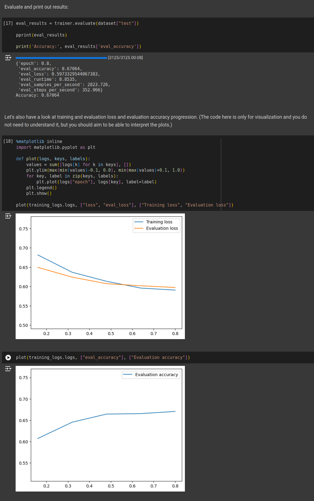
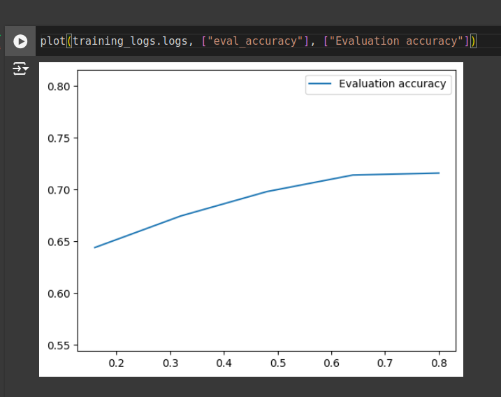
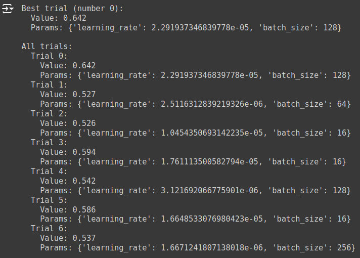
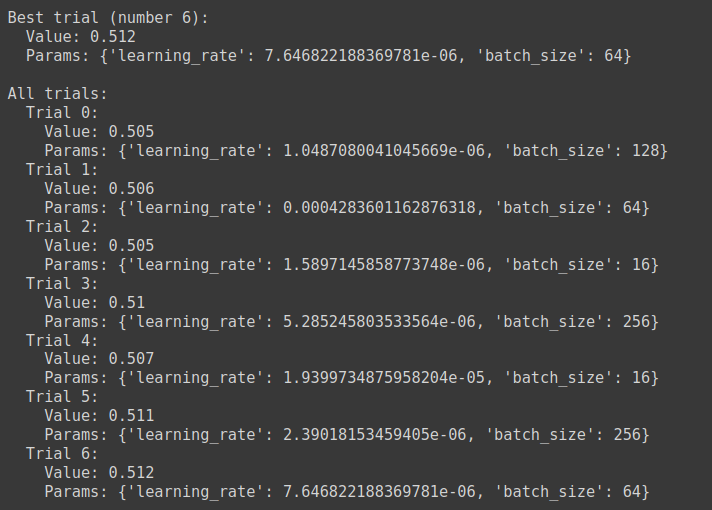

# HYPERPARAMETER OPTIMIZATION

<head>
  <link rel="stylesheet" href="../styles.css">
</head>

## CNN Hyperparameter optimization

Hyperparameter optimization

Both the CNN and RNN notebooks showed improvements over the 50% random baseline, however, this does not represent a particularly high level of performance for this dataset. Can you improve on the performance by adjusting the hyperparameters?

Report which hyperparameters you modified and how these modifications affected the results. What is the highest accuracy you were able to achieve?

You can experiment with these hyperparameters (or any other parameters you find interesting): max_length, embedding_dim, filter_size (CNN), num_filters (CNN), hidden_size (RNN), nonlinearity (RNN), learning_rate, per_device_train_batch_size, max_steps

All done like in the provided notebook, so baseline is with:

```python

### CONFIG

config = BasicConfig(
    vocab_size = tokenizer.vocab_size,
    num_labels = len(set(dataset['train']['label'])),
    embedding_dim = 64,
    filter_size = 3,
    num_filters = 10,
)

### ARGS

trainer_args = transformers.TrainingArguments(
    "checkpoints",
    evaluation_strategy="steps",
    logging_strategy="steps",
    load_best_model_at_end=True,
    eval_steps=500,
    logging_steps=500,
    learning_rate=0.001,
    per_device_train_batch_size=8,
    max_steps=2500,
)
```



### ARGS

* `embedding_dim` 64 => 128 increased Accuracy: 0.68996
* with keeping `embedding_dim` as 128 and increased `filter_size` 3 ==> 6 Accuracy: 0.69264
* keeping above as is and doubling the `num_filters`10 ==> 20 Accuracy: 0.71584



After that i run optuna study like presented in intro to HLT exercise 6 with minor adjustments to parameters:

```python
import optuna

def objective(trial):
    # Define the search space for hyperparameters
    learning_rate = trial.suggest_float("learning_rate", 1e-6, 1e-3, log=True)
    batch_size = trial.suggest_categorical("batch_size", [16, 64, 128, 256])


    trainer_args = transformers.TrainingArguments(
        "cnn_checkpoints", #save checkpoints here
        evaluation_strategy="steps",
        logging_strategy="steps",
        eval_steps=500,
        logging_steps=500,
        learning_rate=learning_rate, #learning rate of the gradient descent
        max_steps=10000,
        load_best_model_at_end=True,
        per_device_train_batch_size=batch_size,
        per_device_eval_batch_size=batch_size
    )

    model = SimpleCNN(config)

    trainer = transformers.Trainer(
        model=model,
        args=trainer_args,
        train_dataset=dataset["train"],
        eval_dataset=dataset["test"].select(range(1000)), #make a smaller subset to evaluate on
        compute_metrics=compute_accuracy,
        data_collator=data_collator,
        callbacks=[early_stopping]
    )

    # Train the model and get the best validation loss
    trainer.train()
    eval_results = trainer.evaluate()
    return eval_results["eval_accuracy"] #let's try to maximize accuracy

study = optuna.create_study(direction="maximize")
study.optimize(objective, n_trials=7)
```



So with adjusting trainer parameters it actually got worse and the best results were 71.5% from config.

## RNN

baseline achieved was:

```python
{'epoch': 0.8,
 'eval_accuracy': 0.50812,
 'eval_loss': 0.6931626796722412,
 'eval_runtime': 10.1816,
 'eval_samples_per_second': 2455.4,
 'eval_steps_per_second': 306.925}
Accuracy: 0.50812
```

### RNN ARGS

* with change of `nonlinearity` from "tanh" to "relu"

```python
    {'epoch': 0.8,
 'eval_accuracy': 0.51412,
 'eval_loss': 0.6923446655273438,
 'eval_runtime': 10.0994,
 'eval_samples_per_second': 2475.395,
 'eval_steps_per_second': 309.424}
Accuracy: 0.51412
```

* After doubling the `hidden_size` from 96 to 192 i saw virtually nonexistent change

```python
{'epoch': 0.8,
 'eval_accuracy': 0.51228,
 'eval_loss': 0.6925438046455383,
 'eval_runtime': 10.0167,
 'eval_samples_per_second': 2495.83,
 'eval_steps_per_second': 311.979}
Accuracy: 0.51228
```

* Stacking the layers `num_layers` from 1 ==> 5 also did nothing

```python
{'epoch': 0.8,
 'eval_accuracy': 0.5112,
 'eval_loss': 0.6929822564125061,
 'eval_runtime': 13.9058,
 'eval_samples_per_second': 1797.809,
 'eval_steps_per_second': 224.726}
Accuracy: 0.5112
```

so i left the parameters as they now were and conducted optuna study

```python
    import optuna

def objective(trial):
    # Define the search space for hyperparameters
    learning_rate = trial.suggest_float("learning_rate", 1e-6, 1e-3, log=True)
    batch_size = trial.suggest_categorical("batch_size", [16, 64, 128, 256])


    trainer_args = transformers.TrainingArguments(
        "rnn_checkpoints", #save checkpoints here
        evaluation_strategy="steps",
        logging_strategy="steps",
        eval_steps=500,
        logging_steps=500,
        learning_rate=learning_rate, #learning rate of the gradient descent
        max_steps=10000,
        load_best_model_at_end=True,
        per_device_train_batch_size=batch_size,
        per_device_eval_batch_size=batch_size
    )

    model = SimpleRNN(config)

    trainer = transformers.Trainer(
        model=model,
        args=trainer_args,
        train_dataset=dataset["train"],
        eval_dataset=dataset["test"].select(range(1000)), #make a smaller subset to evaluate on
        compute_metrics=compute_accuracy,
        data_collator=data_collator,
        callbacks=[early_stopping]
    )

    # Train the model and get the best validation loss
    trainer.train()
    eval_results = trainer.evaluate()
    return eval_results["eval_accuracy"] #let's try to maximize accuracy

study = optuna.create_study(direction="maximize")
study.optimize(objective, n_trials=7)
```



I actually managed not to get any increase in the accuracy
