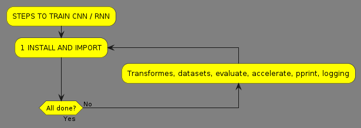

# Deep learning week2 exercise 1

Your task is to carefully study the notebooks, and write a step-by-step summary of key steps to train and evaluate such a model. Keep in mind that many of these steps will be applicable throughout the course, even if the specific model differs. Therefore, it is essential to grasp the key concepts. As most of the code is shared in these two notebooks, writing just one summary is enough, but in the model building part, you should refer to both CNN/RNN implementations.

## 1 Install and import



Setup

in this phase install via pip:

* `transformers` is a popular deep learning package
* `datasets` provides support for loading, creating, and manipulating datasets
* `evaluate` is a library for easily evaluating machine learning models and datasets
* `accelerate` is a wrapper we need to install in order to train torch models using a transformers trainer

install all of the above:

```python
!pip3 install -q transformers datasets evaluate accelerate
```

* `pprint` to formulate prints for some data structures

```python
from pprint import PrettyPrinter
pprint = PrettyPrinter(compact=True).pprint
```

* `logging`  to reduce `transformers` verbose logging ops. Remove this to get all low level info also

```python
import logging
logging.disable(logging.INFO)
```

## 2 Download and prepare data


### 2A Download huggingface dataset

* Import `datasets` and download for example the imdb dataset from huggingface

```python
import datasets
#https://huggingface.co/docs/datasets/main/en/package_reference/loading_methods#datasets.load_dataset
dataset = datasets.load_dataset("imdb")
```

* Check the quality / splits

```python
print(dataset)

DatasetDict({
    train: Dataset({
        features: ['text', 'label'],
        num_rows: 25000
    })
    test: Dataset({
        features: ['text', 'label'],
        num_rows: 25000
    })
    unsupervised: Dataset({
        features: ['text', 'label'],
        num_rows: 50000
    })
})
```

### 2B Shuffle the data

* Shuffle

```python
dataset = dataset.shuffle() #This is never a bad idea, datasets may have ordering to them, which is not what we want
#del dataset["unsupervised"] Delete the unlabeled part of the dataset to make things faster
```

## 3 Tokenize and vectorize


### 3A

* Import transformers
* Models are listed at [https://huggingface.co/models](https://huggingface.co/models)
* Assing pretrained AutoTokenizer to variable

```python
import transformers

# Text in IMDB dataset in english, use the bert-cased
MODEL = "bert-base-cased"
tokenizer = transformers.AutoTokenizer.from_pretrained(MODEL)
```

### 3B

```python
def tokenizer(dataset_entry: dict) --> dict:
    return tokenizer(dataset_entry["text"],
                    max_length=128, #limits the maximum length of outputs to the given length
                    truncation=True) # faster train and potential performance gains
```

### 3C

```python
# https://huggingface.co/docs/transformers/preprocessing#everything-you-always-wanted-to-know-about-padding-and-truncation
dataset = dataset.map(tokenizer)
```

## 4 BUILD THE MODEL

### CNN


```python
import torch
BasicConfig = transformers.PretrainedConfig #nice way to start
```

1) Token IDs are mapped to embeddings of a user-specific size (`config.embedding_dim`) in a [torch.nn.Embedding](https://pytorch.org/docs/stable/generated/torch.nn.Embedding.html) layer. Typically initialized with previously leanerd weights, here starts with random

    ```python
    # SELF HERE MEANS THE MODEL CLASS, ALL COMES TOGETHER IN THE END UNDER ONE CLASS :-)
    # Embedding layer: vocab size x embedding dim
    self.embeddings = torch.nn.Embedding(
        num_embeddings=config.vocab_size,
        embedding_dim=config.embedding_dim
    )
    ```

2) Number of filters, specified by the user is applied to the matrix formed by the sequence of token embedding in a convolution layer (*think these filters with the image example*)

    ```python
    # Convolution layer:
    self.convolution = torch.nn.Conv1d(
        config.embedding_dim,
        config.num_filters,
        config.filter_size,
        padding=1
        )
    ```

3) The outputs of the convolution layers are passed through a non-linear activation function. ere the simple ReLU ([torch.nn.ReLU](https://pytorch.org/docs/stable/generated/torch.nn.ReLU.html)) which thresholds each value at 0 ($\textrm{max}(0,x)$, i.e. any value < 0 is set to 0)

    ```python
    # Activation function following convolution
    self.activation = torch.nn.ReLU()
    ```

4) The outputs are max-pooled globally using [torch.nn.AdaptiveMaxPool1d](https://pytorch.org/docs/stable/generated/torch.nn.AdaptiveMaxPool1d.html), taking only the largest value output by each of the filters (after the activation function). Generaters translational invariance: the pooled output contains information on how well each filter "matched" the input, but not where that "match" was found.
    > Translational invariance, means that a model will produce the same result for a given input image, regardless of where the features are located within the image. CNNs are invariant to small translation of features within an image, and this is due to the use of max-pooling operations.
    [source](https://www.sciencedirect.com/topics/computer-science/translational-invariance) -- HERE IMAGE EXAMPLE IS USED BUT SAME FOR TEXT --

    ```python
    # Pooling layer: global max pooling, regardless of input length
        self.pooling_layer = torch.nn.AdaptiveMaxPool1d(
            output_size=1
        )
    ```

5) Fully connected layer ([torch.nn.Linear](https://pytorch.org/docs/stable/generated/torch.nn.Linear.html)) that maps the pooled values to the two possible output values

    ```python
    # Output layer: num filters to output size
        self.output_layer = torch.nn.Linear(
            in_features=config.num_filters,
            out_features=config.num_labels
        )
    ```

6) Loss function of the classification: [torch.nn.CrossEntropyLoss](https://pytorch.org/docs/stable/generated/torch.nn.CrossEntropyLoss.html)

    ```python
    self.loss = torch.nn.CrossEntropyLoss()
    ```
