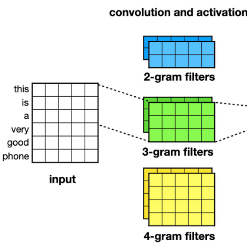
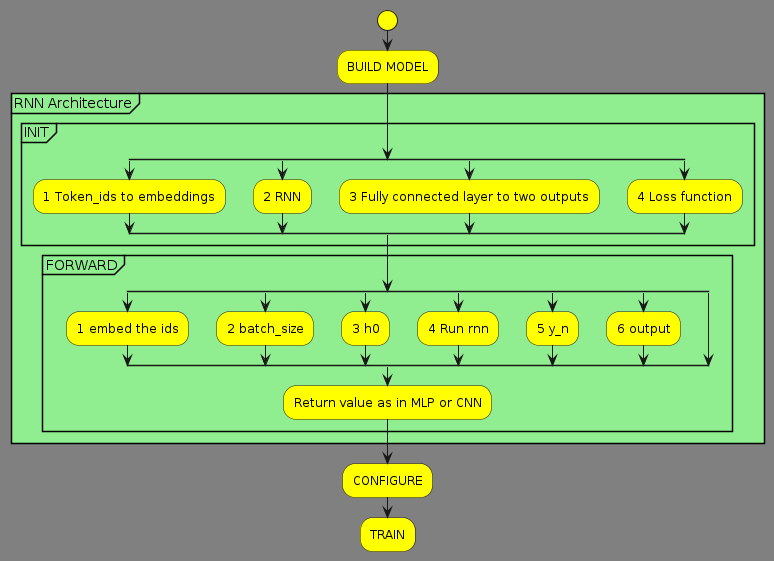
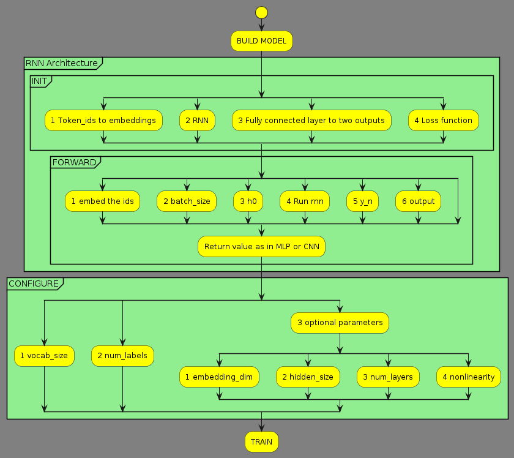

# Deep learning week2 exercise 1

Your task is to carefully study the notebooks, and write a step-by-step summary of key steps to train and evaluate such a model. Keep in mind that many of these steps will be applicable throughout the course, even if the specific model differs. Therefore, it is essential to grasp the key concepts. As most of the code is shared in these two notebooks, writing just one summary is enough, but in the model building part, you should refer to both CNN/RNN implementations.


## 1 Install and import


Setup

in this phase install via pip:

* `transformers` is a popular deep learning package
* `datasets` provides support for loading, creating, and manipulating datasets
* `evaluate` is a library for easily evaluating machine learning models and datasets
* `accelerate` is a wrapper we need to install in order to train torch models using a transformers trainer

install all of the above:

```python
!pip3 install -q transformers datasets evaluate accelerate
```

* `pprint` to formulate prints for some data structures

```python
from pprint import PrettyPrinter
pprint = PrettyPrinter(compact=True).pprint
```

* `logging`  to reduce `transformers` verbose logging ops. Remove this to get all low level info also

```python
import logging
logging.disable(logging.INFO)
```

## 2 Download and prepare data


### 2A Download huggingface dataset

* Import `datasets` and download for example the imdb dataset from huggingface

```python
import datasets
#https://huggingface.co/docs/datasets/main/en/package_reference/loading_methods#datasets.load_dataset
dataset = datasets.load_dataset("imdb")
```

* Check the quality / splits

```python
print(dataset)

DatasetDict({
    train: Dataset({
        features: ['text', 'label'],
        num_rows: 25000
    })
    test: Dataset({
        features: ['text', 'label'],
        num_rows: 25000
    })
    unsupervised: Dataset({
        features: ['text', 'label'],
        num_rows: 50000
    })
})
```

### 2B Shuffle the data

* Shuffle

```python
dataset = dataset.shuffle() #This is never a bad idea, datasets may have ordering to them, which is not what we want
#del dataset["unsupervised"] Delete the unlabeled part of the dataset to make things faster
```

## 3 Tokenize and vectorize


### 3A

* Import transformers
* Models are listed at [https://huggingface.co/models](https://huggingface.co/models)
* Assing pretrained AutoTokenizer to variable

```python
import transformers

# Text in IMDB dataset in english, use the bert-cased
MODEL = "bert-base-cased"
tokenizer = transformers.AutoTokenizer.from_pretrained(MODEL)
```

### 3B

```python
def tokenizer(dataset_entry: dict) --> dict:
    return tokenizer(dataset_entry["text"],
                    max_length=128, #limits the maximum length of outputs to the given length
                    truncation=True) # faster train and potential performance gains
```

### 3C

```python
# https://huggingface.co/docs/transformers/preprocessing#everything-you-always-wanted-to-know-about-padding-and-truncation
dataset = dataset.map(tokenizer)
```

## 4 BUILD, CONFIGURE, TRAIN

### CNN

#### MODEL


```python
import torch
BasicConfig = transformers.PretrainedConfig #nice way to start
```

1) Token IDs are mapped to embeddings of a user-specific size (`config.embedding_dim`) in a [torch.nn.Embedding](https://pytorch.org/docs/stable/generated/torch.nn.Embedding.html) layer. Typically initialized with previously leanerd weights, here starts with random

    ```python
    # SELF HERE MEANS THE MODEL CLASS, ALL COMES TOGETHER IN THE END UNDER ONE CLASS :-)
    # Embedding layer: vocab size x embedding dim
    self.embeddings = torch.nn.Embedding(
        num_embeddings=config.vocab_size,
        embedding_dim=config.embedding_dim
    )
    ```

2) Number of filters, specified by the user is applied to the matrix formed by the sequence of token embedding in a convolution layer (*think these filters with the image example*)

    ```python
    # Convolution layer:
    self.convolution = torch.nn.Conv1d(
        config.embedding_dim,
        config.num_filters,
        config.filter_size,
        padding=1
        )
    ```

3) The outputs of the convolution layers are passed through a non-linear activation function. ere the simple ReLU ([torch.nn.ReLU](https://pytorch.org/docs/stable/generated/torch.nn.ReLU.html)) which thresholds each value at 0 ($\textrm{max}(0,x)$, i.e. any value < 0 is set to 0)

    ```python
    # Activation function following convolution
    self.activation = torch.nn.ReLU()
    ```

4) The outputs are max-pooled globally using [torch.nn.AdaptiveMaxPool1d](https://pytorch.org/docs/stable/generated/torch.nn.AdaptiveMaxPool1d.html), taking only the largest value output by each of the filters (after the activation function). Generaters translational invariance: the pooled output contains information on how well each filter "matched" the input, but not where that "match" was found.
    > Translational invariance, means that a model will produce the same result for a given input image, regardless of where the features are located within the image. CNNs are invariant to small translation of features within an image, and this is due to the use of max-pooling operations.
    [source](https://www.sciencedirect.com/topics/computer-science/translational-invariance) -- HERE IMAGE EXAMPLE IS USED BUT SAME FOR TEXT --

    ```python
    # Pooling layer: global max pooling, regardless of input length
        self.pooling_layer = torch.nn.AdaptiveMaxPool1d(
            output_size=1
        )
    ```

5) Fully connected layer ([torch.nn.Linear](https://pytorch.org/docs/stable/generated/torch.nn.Linear.html)) that maps the pooled values to the two possible output values

    ```python
    # Output layer: num filters to output size
        self.output_layer = torch.nn.Linear(
            in_features=config.num_filters,
            out_features=config.num_labels
        )
    ```

6) Loss function of the classification: [torch.nn.CrossEntropyLoss](https://pytorch.org/docs/stable/generated/torch.nn.CrossEntropyLoss.html)

    ```python
    self.loss = torch.nn.CrossEntropyLoss()
    ```

* `forward` passes to the next layer or returns output


#### CNN CONFIGURE


```python
config = BasicConfig(
    vocab_size = tokenizer.vocab_size,
    num_labels = len(set(dataset['train']['label'])),
    embedding_dim = 64,
    filter_size = 3,
    num_filters = 10,
)

model = SimpleCNN(config)
```

1) `vocab_size` is always the size of the tokenizer
2) `num_labels` is *number of unique labels* in the data
3) `optional` are adjustable hyperparameters of which:
    * `embedding_dim` is the size of the word embeddings (token)
    * `filter_size` the size of the convolution filter (for picture think of height x width window) here only one dimension height (*n-grams*)
    
    * `num_filters` COUNT of different convolution filters


### RNN

#### RNN MODEL



##### init

```python
import torch
BasicConfig = transformers.PretrainedConfig #nice way to start
```

1) Token id's are mapped to embeddings of a user-specific size defined in `config.embedding_dim` parameter in a in a [torch.nn.Embedding](https://pytorch.org/docs/stable/generated/torch.nn.Embedding.html) layer. Weights initialized randomly

    ```python
        self.embeddings = torch.nn.Embedding(
            num_embeddings=config.vocab_size,
            embedding_dim=config.embedding_dim
        )
    ```

2) Embedded imputs are passed through an RNN ([torch.nn.RNN](https://pytorch.org/docs/stable/generated/torch.nn.RNN.html)) which produces a series of outputs ($(y_1, \ldots, y_n)$, where $n$ is the length of the input) and the final hidden state $h_n$. Here, we will only use the last output $y_n$.

    ```python
    self.rnn = torch.nn.RNN(
        input_size=config.embedding_dim,
        hidden_size=config.hidden_size,
        num_layers=config.num_layers,
        nonlinearity=config.nonlinearity,
        batch_first=True
    )
    ```

3) The output of RNN is connected to fully connected layer ([torch.nn.Linear](https://pytorch.org/docs/stable/generated/torch.nn.Linear.html)) that maps the last RNN output to the two possible values of the classifier

    ```python
    self.output_layer = torch.nn.Linear(
        in_features=config.hidden_size,
        out_features=config.num_labels #desired amount of labels
    )
    ```

4) Classification is run through a loss function

    ```python
    self.loss = torch.nn.CrossEntropyLoss() #same as CNN
    ```

##### Forward

For RNN the `forward` function acts a little different from CNN where it only goes *forward*

1) Embed the ids

    ```python
    x = self.embeddings(input_ids) 
    ```

2) set the size of the batch to x

    ```python
    batch_size = x.shape[0]
    ```

3) set the initial hidden state to zeroes

    ```python
    h0 = torch.zeroes((self.config.num_layers, batch_size, self.config.hidden_size),
        device=input_ids.device    # place on same device as input
    )
    ```

4) Run RNN repeatedly to get sequence of outputs `rnn_outputs` and the final hidden state `h_n`

    ```python
    rnn_outputs, h_n = self.rnn(x,h0)
    ```

5) Get the last output `y_n`

    ```python
    # get the actual last output
    y_n = rnn.outputs[:,-1,:]
    ```

6) Map to outputs with fully connected layer

    ```python
    output = self.output_layer(y_n)
    ```

7) Return as in MLP or CNN

    ```python
    # Return value computed as in MLP and CNN:
        if labels is not None:
            # We have labels, so we can calculate the loss
            return (self.loss(output,labels), output)
        else:
            # No labels, so just return the output
            return (output,)
    ```

#### RNN CONFIGURE



```python
config = BasicConfig(
    vocab_size = tokenizer.vocab_size,
    num_labels = len(set(dataset["train"]["label"])),
    embedding_dim = 64,
    hidden_size = 96,
    num_layers = 1,
    nonlinearity = "tanh",
)

model = SimpleRNN(config)
```

1) `vocab_size` always the vocabulary size of the tokenizer
2) `num_labels` desired amount of labels
3) `embedding_dim` size of word (== token) embeddings
4) `hidden_size` size of the hidden `h` vector of RNN
5) `num_layers` number of stacked RNN layers
6) `nonlinearity` the non-linear function to apply, here `tanh` is chosen

### TRAIN


#### Training arguments

Use hf `trainer` class

workflow:

* load the arguments that control the training
* configurable metrics to evaluate performance
* data collator builds the batches
* early stopping callback stops when eval loss no longer improves

Specify hyperparamenters and other settings for training

* `learning_rate` the step size for weight updates
* `per_device_train_batch_size` number of examples per batch
* `max_steps` the max number of steps to train for

```python
# https://huggingface.co/docs/transformers/en/main_classes/trainer
trainer_args = transformers.TrainingArguments(
    "checkpoints",
    evaluation_strategy="steps",
    """
    eval_strategy (str or IntervalStrategy, optional, defaults to "no") — The evaluation strategy to adopt during training. Possible values are:
    "no": No evaluation is done during training.
    "steps": Evaluation is done (and logged) every eval_steps.
    "epoch": Evaluation is done at the end of each epoch.
    """
    logging_strategy="steps",
    """
    logging_strategy (str or IntervalStrategy, optional, defaults to "steps") — The logging strategy to adopt during training. Possible values are:

    "no": No logging is done during training.
    "epoch": Logging is done at the end of each epoch.
    "steps": Logging is done every logging_steps.
    """
    load_best_model_at_end=True,
    """
    (bool, optional, defaults to False) — Whether or not to load the best model found during training at the end of training. When this option is enabled, the best checkpoint will always be saved. See save_total_limit for more.
    """
    eval_steps=500,
    """
    (int or float, optional) — Number of update steps between two evaluations if eval_strategy="steps". Will default to the same value as logging_steps if not set. Should be an integer or a float in range [0,1). If smaller than 1, will be interpreted as ratio of total training steps.
    """
    logging_steps=500,
    """
    (int or float, optional, defaults to 500) — Number of update steps between two logs if logging_strategy="steps". Should be an integer or a float in range [0,1). If smaller than 1, will be interpreted as ratio of total training steps.
    """
    learning_rate=0.001,
    """
    (float, optional, defaults to 5e-5) — The initial learning rate for AdamW optimizer.
    """
    per_device_train_batch_size=8,
    """
    (int, optional, defaults to 8) — The batch size per GPU/XPU/TPU/MPS/NPU core/CPU for training.
    """
    max_steps=2500,
    """
    (int, optional, defaults to -1) — If set to a positive number, the total number of training steps to perform. Overrides num_train_epochs. For a finite dataset, training is reiterated through the dataset (if all data is exhausted) until max_steps is reached.
    """
)
```

#### Evaluation

Create metric for evaluation of performance during and after training.

```python
#https://pypi.org/project/evaluate/
import evaluate

#https://huggingface.co/spaces/evaluate-metric/accuracy
#Accuracy = (TP + TN) / (TP + TN + FP + FN)
accuracy = evaluate.load("accuracy")
"""
to instantiate an evaluation module
"""

def compute_accuracy(outputs_and_labels):
    outputs, labels = outputs_and_labels
    predictions = outputs.argmax(axis=-1) #TODO: check if it does use numpys argmax?
    return accuracy.compute(predictions=predictions, references=labels)

data_collator = transformers.DataCollatorWithPadding(tokenizer)

# Argument gives the number of steps of patience before early stopping
early_stopping = transformers.EarlyStoppingCallback(
    early_stopping_patience=5
)

```

```python
TODO: ANALYZE THIS

from collections import defaultdict

class LogSavingCallback(transformers.TrainerCallback):
    def on_train_begin(self, *args, **kwargs):
        self.logs = defaultdict(list)
        self.training = True

    def on_train_end(self, *args, **kwargs):
        self.training = False

    def on_log(self, args, state, control, logs, model=None, **kwargs):
        if self.training:
            for k, v in logs.items():
                if k != "epoch" or v not in self.logs[k]:
                    self.logs[k].append(v)

training_logs = LogSavingCallback()
```

#### Trainer


* `model` is the CLASS of the model
* `args` is the training arguments
* `train_dataset` is the train split of the dataset
* `eval_dataset` is the test split of the dataset
* `compute_metrics` is the function made in evaluation block
* `data_collator` is the call made to `transformers.DataCollatorWithPadding(tokenizer)`
* `callbacks` array containing `early_stopping` requirement and `training_logs` logger for analysing the training processes

### RESULTS

Evaluate and print out the results

```python
eval_results = trainer.evaluate(dataset["test"])

pprint(eval_results)

print('Accuracy:', eval_results['eval_accuracy'])
```

```python

%matplotlib inline
import matplotlib.pyplot as plt

def plot(logs, keys, labels):
    values = sum([logs[k] for k in keys], [])
    plt.ylim(max(min(values)-0.1, 0.0), min(max(values)+0.1, 1.0))
    for key, label in zip(keys, labels):
        plt.plot(logs["epoch"], logs[key], label=label)
    plt.legend()
    plt.show()

plot(training_logs.logs, ["loss", "eval_loss"], ["Training loss", "Evaluation loss"])

```
